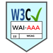
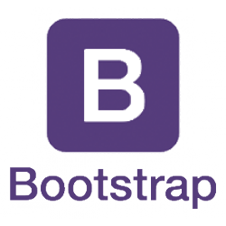

# Mobile Responsive Community Theme <small> by</small>


**Powered By**
----
   

## Requirements
This mobile responsive community theme runs on thirty bees shopping cart. Read the main [**software requirements**](https://github.com/thirtybees/thirtybees#requirements "thirty bees shopping cart requirements") for this shopping cart.

## Building

This theme works as-is on thirty bees, all built files are committed to the repository.

CSS files shouldn't get edited directly, but their Sass counterpart in `sass/` instead. After doing so, CSS gets compiled from that. For contributions, please create commits including both, source file changes together with their build results.

### Setting up the build environment
```
npm install
```
### Building CSS from Sass
```
npm run compile-css
```
### Building JavaScript
```
npm run format-js
```

## Contributing
See [CONTRIBUTING.md](CONTRIBUTING.md)
